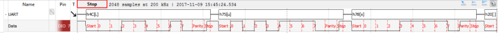



# Projeto 3.1 - Serialização/Desserialização 

O objetivo principal deste projeto é a compreensão de como uma mensagem é serializada/desserializada nos níveis mais baixos de uma comunicação.
Para a realização do projeto, foi utilizado o protocolo UART e dois Arduino Due.


 
## Protocolo UART

O protocolo UART possui como valor inicial 1 (sinal HIGH) e a recepção é iniciada quando é enviado um START BIT, de valor 0 (LOW). Com o START BIT enviado, a transmissão dos dados é iniciada.
Cada payload é um caractere de uma frase arbitrária a ser transmitida e cada caractere retorna um conjunto de 8 bits (1 byte). Após o envio do payload é enviado o bit de paridade, que tem por função checar se o pacote enviado está ou não corrompido.
Por fim o STOP BIT, de valor 1 (HIGH), é enviado, retornando o protocolo ao seu estado inicial.

A imagem a seguir representa um pacote transmitido pelo protocolo UART.

 

## Resultados no WaveForms

O gráfico a seguir foi obtido utilizando um Arduino Due rodando o código de transmissão um Analog Discovery. O pino TX1 do Arduino foi conectado no pino 7 do Analog e ambos compontentes foram conectados no terra.
 
 

No gráfico é possivel identificar os bits (considerando o pacote h4C):

OBSERVAÇÃO: na imagem, o payload está invertido devido ao shift realizado no código (será explicado na seção seguinte).

 - Start bit (0)
 - Caractere L (01001100)
 - Parity bit (1)
 - Stop bit (1)

## Descrição do TX
#### Enviar START BIT

Envia o valor 0 (LOW) para o pino TX


```
digitalWrite(uart -> pin_tx, LOW);
_sw_uart_wait_T(uart);
  }
 ```
     
#### Enviar START BIT

O código percorre bit por bit de cada caractere e realiza um bit shift para a direita e também realizando um and com o byte 0x01. Desta forma, todos os bits são zerados, com excessão do mais significativo. A cada iteração, o bit shift faz com que o bit significativo seja alterado.
 
 ```
for(int i = 0; i <= 7 ; i++) {
     int pyl = data >> i & 0x01;
     digitalWrite(uart -> pin_tx, pyl);
     _sw_uart_wait_T(uart);
   } 
 ```
          
3. Documentação
     - Explicar a comunicação UART
     - Exibir a forma de onda gerada pela implementação (usando o analog discovery)
     - Explicar o código

## Itens extras

- Implementar um protocolo próprio de transmissão e recepção de dados.

## Validação

- Em sala de aula, abrir as duas aplicações em computadores distintos e transmitir uma frase entre eles via o pipeline desenvolvido anteriormente.

## Rubricas

| Nota | Descritivo                                                |
|------|-----------------------------------------------------------|
| A    | - Entregue no prazo                                       |
|      | - Implementado um item do extras                          |
| B    | - Entregue no prazo                                       |
|      | - Implementado requisitos necessários                     |
| C    | - Entregue fora do prazo                                  |
|      | - Implementando requisitos necessários                    |
| D    | - Nem todos os requisitos necessários foram implementados |
| I    | - Não entregue                                            |


